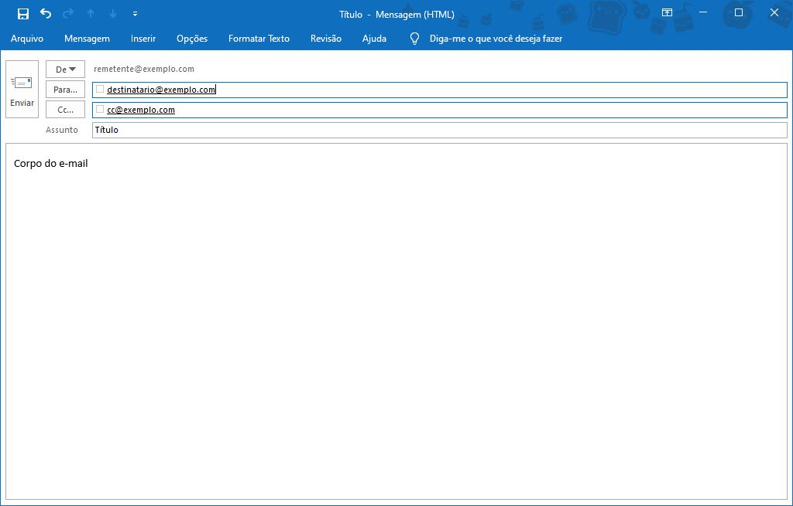

# Integração Python + Outlook para envio de e-mails

Este repositório oferece uma solução simples para integração entre Python e o Microsoft Outlook, permitindo o envio automatizado de e-mails diretamente de scripts Python. Com essa integração, os usuários podem incorporar facilmente funcionalidades de envio de e-mails em seus aplicativos Python, automatizando processos de comunicação por e-mail.


## Introdução
Primeiro precisamos entender a estrutura de um e-mail e os parâmetros que podem ser adicionados:


Seguindo a estrutura, os atributos que você deve especificar são:
- Remetente (por padrão o e-mail principal é utilizado, mas em caso de múltiplos e-mails logados no Outlook é possível especificar qual você gostaria de utilizar)
- Destinatários (obrigatório)
- Destinatários em CC
- Título 
- Corpo do E-mail
- Imagem incorporada no Corpo do E-mail (prints, assinaturas, etc.)
- Anexos


## Integração

O módulo que usaremos para a integração entre as duas ferramentas é o [win32com](https://pypi.org/project/pywin32/), ele fornece uma forma de interagir com uma tecnologia da Microsoft (COM - Component Object Model) que permite a comunicação entre diferentes programas e componentes do ambiente Windows. 

Com o módulo win32com é possível acessar recursos como o Microsoft Office, Outlook, IExplorer e diversos aplicativos Windows, sendo frequentemente usado para automatização de tarefas repetitivas.

## Instalação

Para utilizar o módulo win32com é necessário instalar a biblioteca que ele está inserido, neste caso a biblioteca pywin32.

Para instalar uma biblioteca basta acessar o "Prompt de Comando" e colar o código abaixo:

```
pip install pywin32
```


## Documentação
O primeiro passo é importar a o módulo para que possamos utilizar suas funcionalidades:

```python
import win32com.client
```

Agora para acessar o Outlook usaremos o método Dispatch que é usado para instanciar um programa do sistema Windows:

```python
outlook = win32com.client.Dispatch('Outlook.Application')
```

Feito isso nós vamos criar um novo item usando o método CreateItem, existem alguns tipos de itens que podemos criar, como:

- CreateItem(0): Cria um novo e-mail. Este é o valor padrão quando nenhum tipo é especificado.
- CreateItem(1): Cria uma nova reunião.
- CreateItem(2): Cria uma nova tarefa.
- CreateItem(3): Cria um novo contato.
- CreateItem(4): Cria um novo lembrete.
- CreateItem(5): Cria um novo registro de diário.

Como criaremos um novo e-mail vamos usar: 
```python
email = outlook.CreateItem(0)
```
---
#### Bloco extra
Caso você possua mais de um endereço de e-mail logado no seu Microsoft Outlook e deseje especificar o e-mail a ser usado como remetente, o seguinte código pode te ajudar:

```    
profile = None
    namespace = outlook.GetNamespace("MAPI")
    for acc in namespace.Accounts:
        if acc.SmtpAddress == "email_especificado@exemplo.com":
            profile = acc
            break

    if profile is not None: 
        email._oleobj_.Invoke(*(64209, 0, 8, 0, profile)) # Configurar o perfil do remetente
    else: 
        print("Perfil não encontrado")
```


Este código itera sobre todas as contas disponíveis e se uma dessas contas for igual a conta especificada, o método Invoke seleciona como remetente. Caso não haja nenhuma conta igual a especificada ocorre o erro "Perfil não encontrado".

---

#### Estrutura do e-mail
Agora vamos explorar os elementos da estrutura do e-mail.

Destinatários:
```
email.To("destino_1@exemplo.com")

# Ou

lista_destinatarios = ["destino_1@exemplo.com", "destino_2@exemplo.com", "destino_3@exemplo.com"]
email.To = ';'.join(destinatarios)
```
Destinatários em cópia:
```
email.CC("copia_1@exemplo.com")

# Ou

lista_copias = ["copia_1@exemplo.com", "copia_2@exemplo.com", "copia_3@exemplo.com"]
email.To = ';'.join(lista_copias)
```

#### Título e corpo do e-mail:
Vamos criar um e-mail de exemplo para o envio de um relatório:

```
# Título
email.Subject = "Relatório Semanal de Vendas"

# Corpo
email.Body = "Boa tarde! Segue em anexo o relatório semanal de vendas da equipe 1.
\nQualquer dúvida estou à disposição."

```
#### Imagens incorporadas no e-mail
Para incorporar uma imagem usamos o bloco de código abaixo:
```
print_attachment = email.Attachments.Add("assets/grafico.jpg")
print_attachment.PropertyAccessor.SetProperty("http://schemas.microsoft.com/mapi/proptag/0x3712001E", "imagem")

email.HTMLBody = email.HTMLBody + f''
```
Primeiro adicionamos a imagem como anexo e acessamos a propriedade através do link "http://schemas.microsoft.com/mapi/proptag/0x3712001E" que nos permite inserir a imagem o corpo do e-mail. E por fim, concatena o corpo do e-mail com a imagem selecionada.

#### Anexos
Para adicionar um anexo é bem simples, baste usar novamente o método Attachments.Add:
```
planilha_attachment = email.Attachments.Add("\relatorio.xlsx")
```

#### Finalização
E finalmente, basta enviar o e-mail:
```
email.Send()
```


## Código completo

```
import win32com.client

# Criar uma instância do Outlook
outlook = win32com.client.Dispatch('Outlook.Application')

# Criar um e-mail
email = outlook.CreateItem(0)  # 0 representa o tipo de item de e-mail

# Acessar o perfil desejado pelo endereço de e-mail
profile = None
namespace = outlook.GetNamespace("MAPI")
for acc in namespace.Accounts:
    if acc.SmtpAddress == "meu_email@exemplo.com":
        profile = acc
        break

if profile is not None: 
    email._oleobj_.Invoke(*(64209, 0, 8, 0, profile)) # Configura o perfil do remetente
else: 
    print("Perfil não encontrado")

# Configurar os campos do e-mail
lista_destinatarios = ["destino_1@exemplo.com", "destino_2@exemplo.com", "destino_3@exemplo.com"]
email.To = ';'.join(lista_destinatarios)

lista_copias = ["copia_1@exemplo.com", "copia_2@exemplo.com", "copia_3@exemplo.com"]
email.To = ';'.join(lista_copias)

# Conteúdo do E-Mail
email.Subject = "Relatório Semanal de Vendas"
email.Body = "Boa tarde! Segue em anexo o relatório semanal de vendas da equipe 1.\nQualquer dúvida estou à disposição."

# Anexar imagem
screenshot_attachment = email.Attachments.Add(r"C:\Users\Usuario\Desktop\print_grafico.png")
screenshot_attachment.PropertyAccessor.SetProperty("http://schemas.microsoft.com/mapi/proptag/0x3712001E", "imagem")

# Configurar a imagem como incorporada
email.HTMLBody += ''

# Anexar arquivo de planilha
planilha_attachment = email.Attachments.Add(r"C:\Users\Usuario\Desktop\relatorio.xlsx")

# Enviar o e-mail
email.Send()
```

## Uso/Exemplos
Para usar este repositório basta fazer o download da pasta "dist_low_code" ou adaptar o código mostrado acima para suas necessidades.
No caso Low Code:
- Faça o download da pasta 
- Extraia para o diretório de sua preferência e edite os campos do arquivo "envio_email.py" 
- Agora basta rodar o arquivo "envio_email.py"
